# GoBlob Architecture Diagrams

## 1. C4 Context — System Boundaries

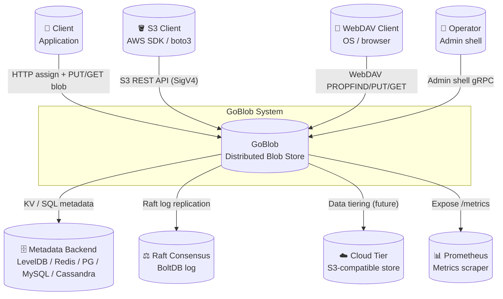

---

## 2. C4 Container — Deployable Units

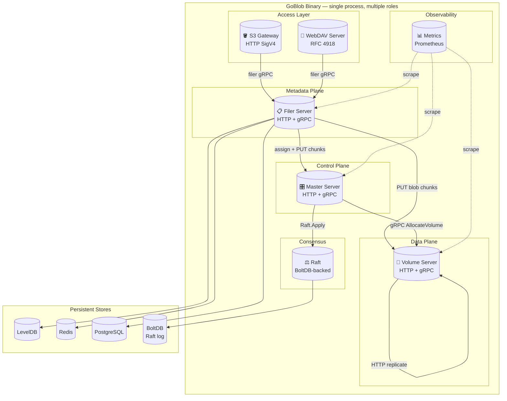

---

## 3. C4 Component — Master Control Plane

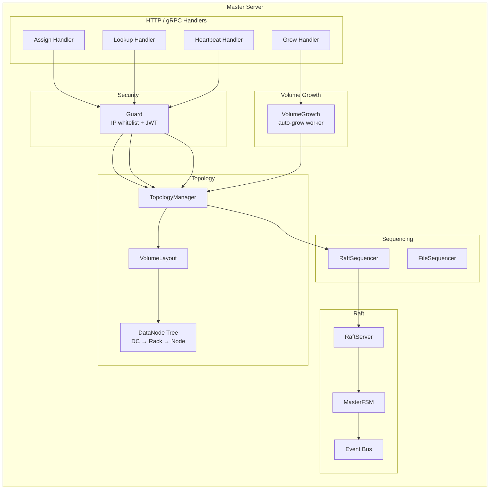

---

## 4. C4 Component — Volume Data Plane

```mermaid
flowchart TB
    subgraph volume[Volume Server]
        direction TB

        subgraph http[HTTP / gRPC Handlers]
            WH[Write Handler\nPUT /{fid}]
            RH[Read Handler\nGET /{fid}]
            DH[Delete Handler]
            RPH[Replication Handler\nPUT + X-Replication]
        end

        subgraph store[VolumeStore]
            VM[Volume Manager]
            VF[Volume Files\n.dat / .idx]
            NE[Needle Engine\nencode/decode/CRC32]
            EC[Erasure Coding\n(optional)]
        end

        subgraph rep[Replication]
            SY[SyncReplicator\nHTTP fan-out]
        end

        subgraph cache[Cache]
            MC[In-Memory LRU\noptional Redis]
        end

        subgraph guard[Security]
            GD2[Guard\nIP whitelist + JWT]
        end
    end

    WH --> GD2 --> NE --> VM --> VF
    WH --> SY
    RH --> GD2 --> MC
    MC -->|"miss"| VM --> NE
    RPH --> GD2 --> NE --> VM
```

---

## 5. C4 Component — Filer Metadata Service

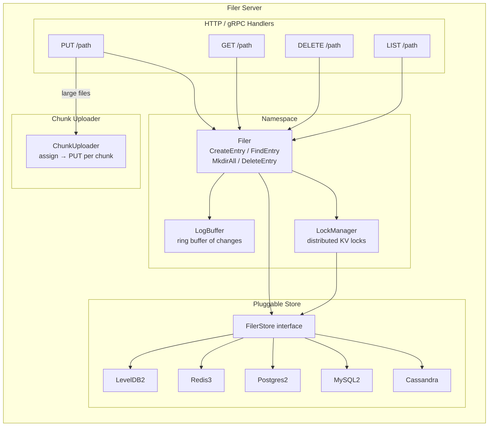

---

## 6. Sequence — Blob Write (full path)

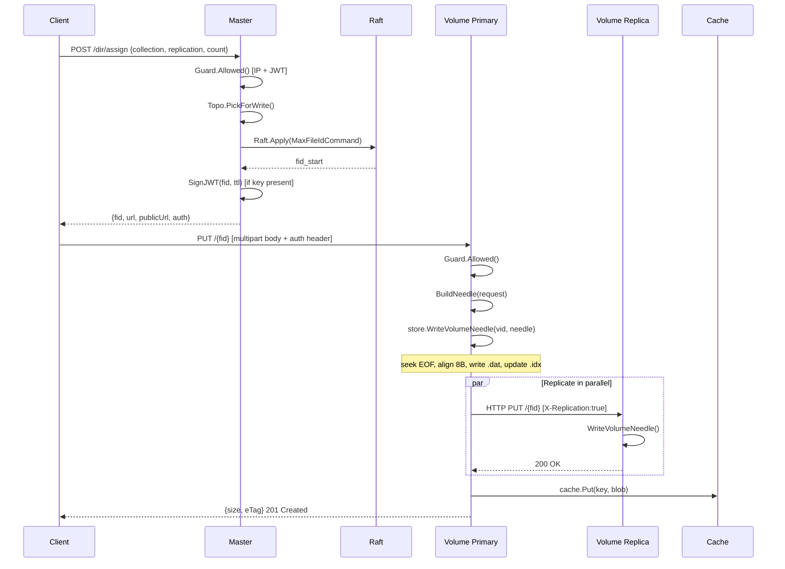

---

## 7. Sequence — Blob Read

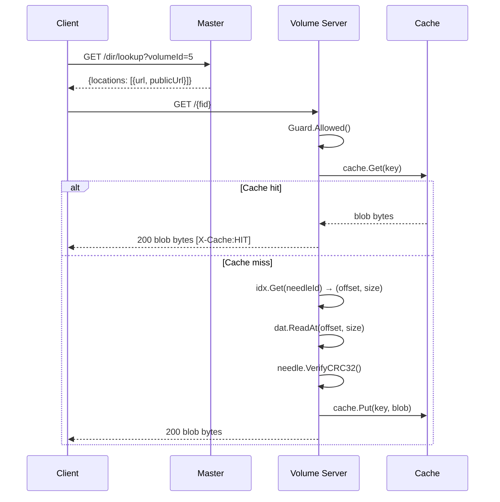

---

## 8. Sequence — S3 PutObject

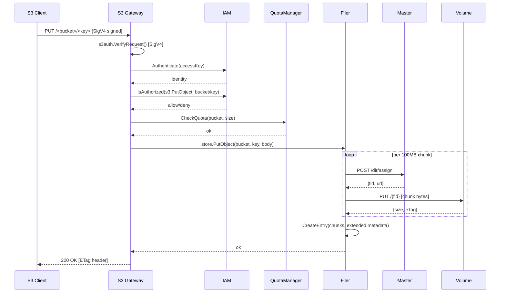

---

## 9. Sequence — Raft Leader Election & ID Sequencing

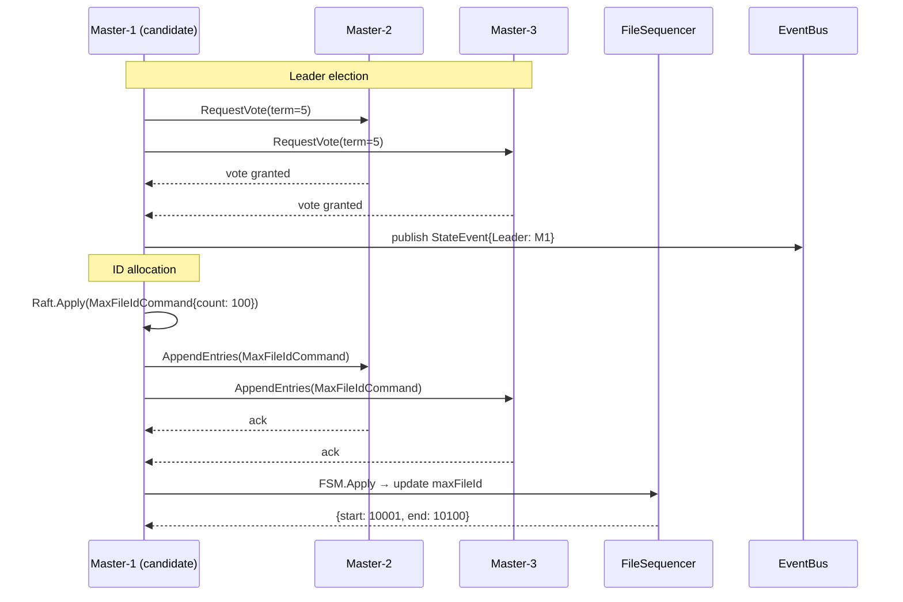

---

## 10. State — Volume Lifecycle

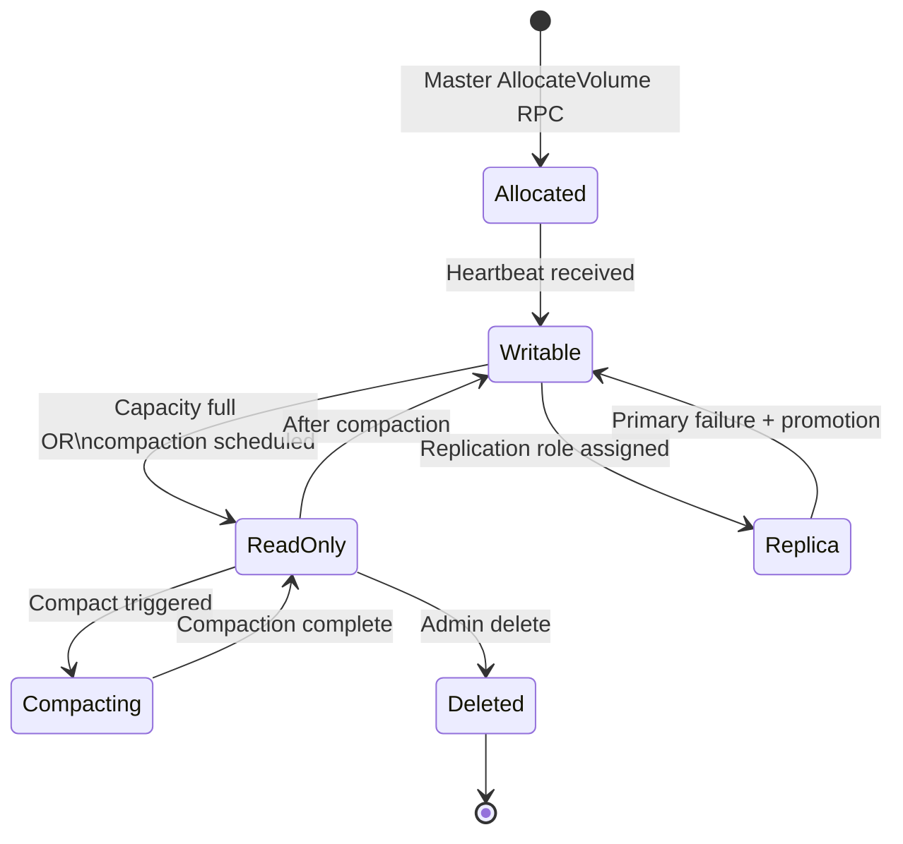

---

## 11. State — Filer Entry Lifecycle

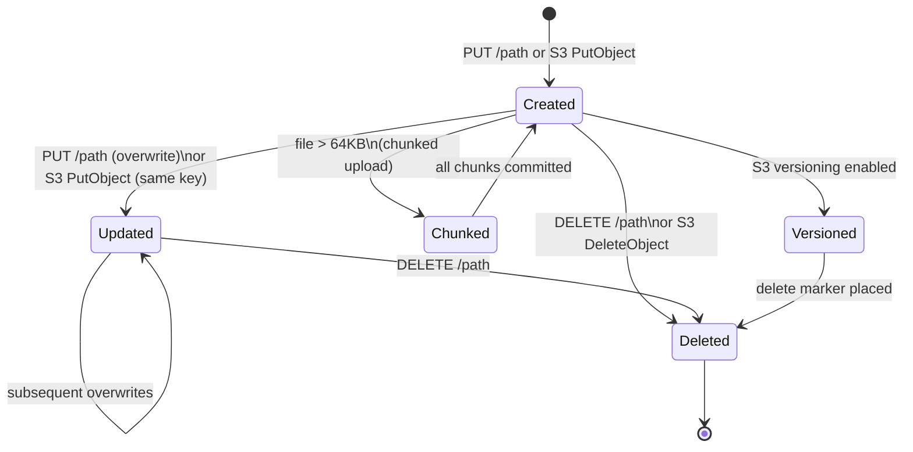

---

## 12. Data Model — Core Types

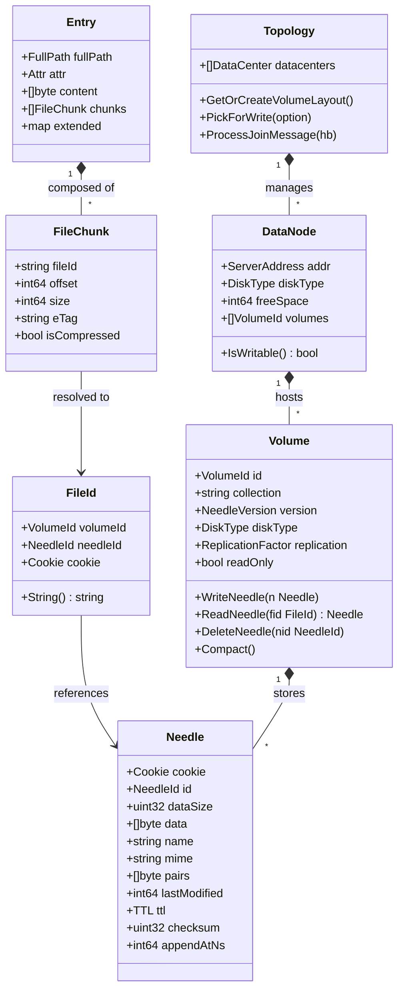

---

## 13. ER — Filer Metadata Schema (logical)

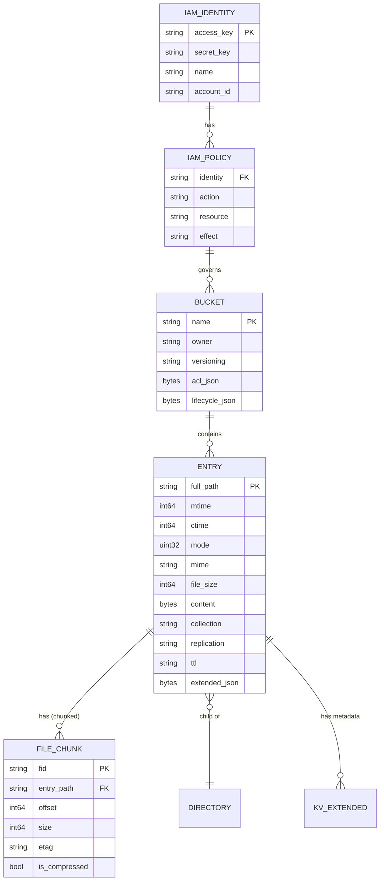

---

## 14. Flowchart — Volume Growth Decision

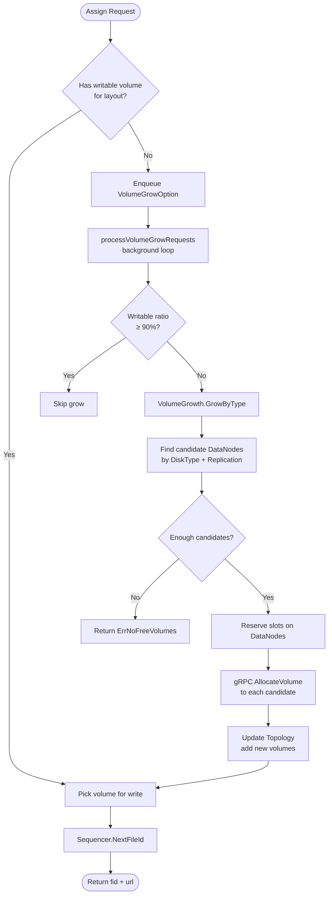

---

## 15. Flowchart — Replication Pipeline (Async)

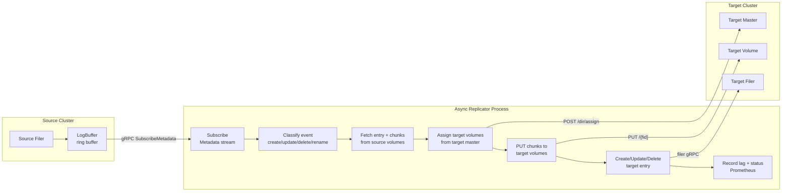
