# GoBlob Architecture Diagrams

## C4 Level 1 — System Context

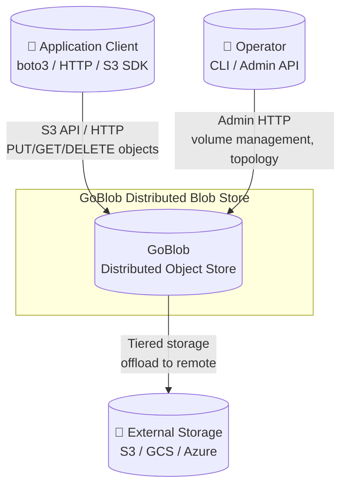

---

## C4 Level 2 — Container Diagram

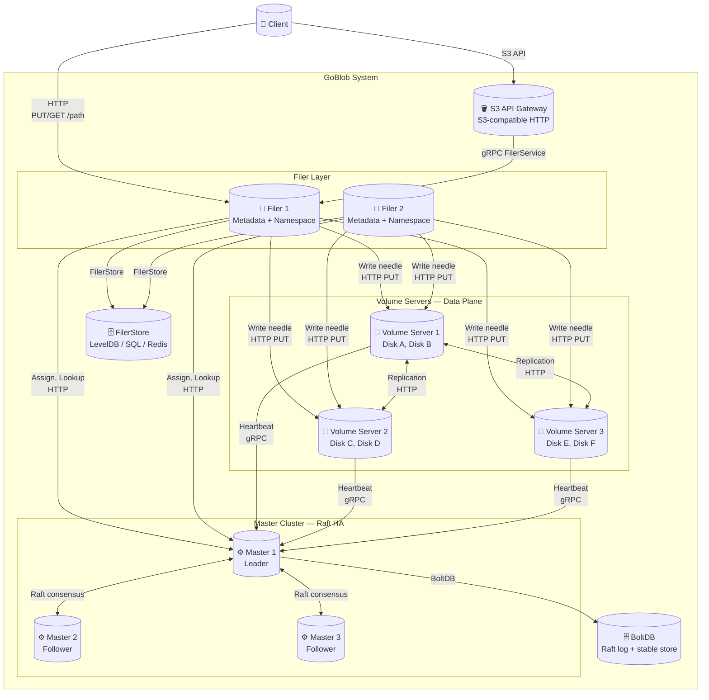

---

## C4 Level 3 — Master Component

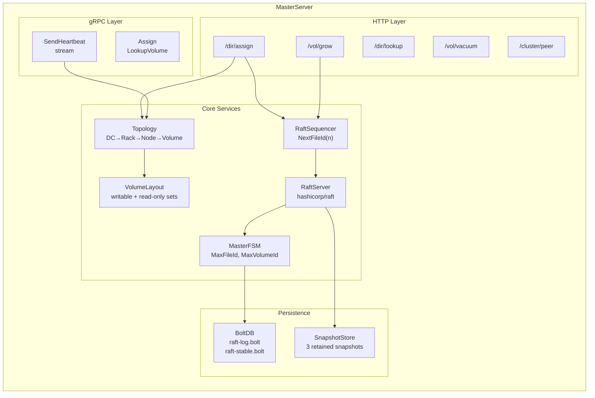

---

## C4 Level 3 — Volume Server Component

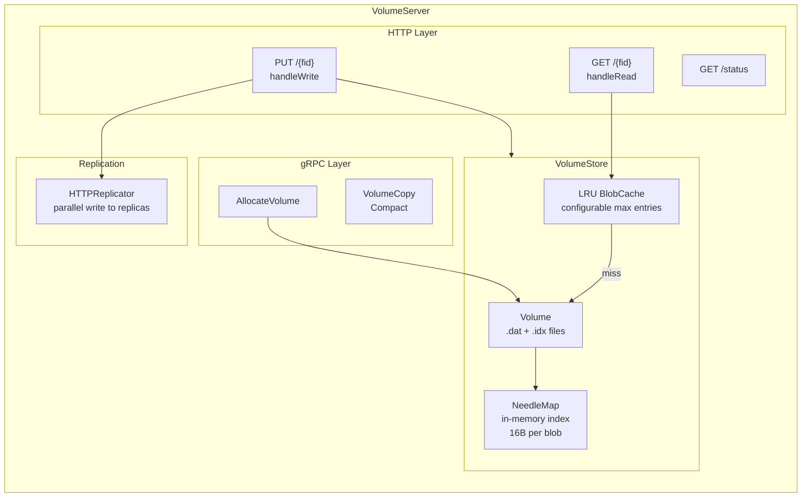

---

## C4 Level 3 — Filer Component

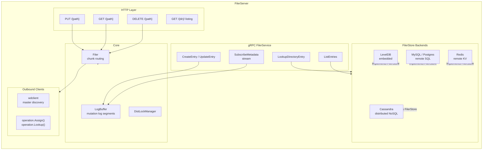

---

## Sequence — File Upload

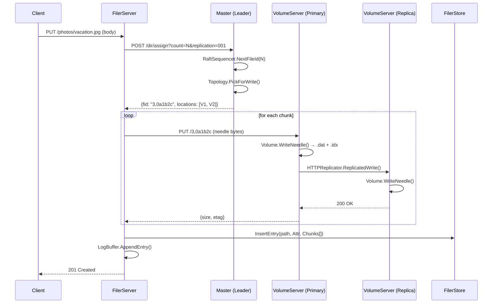

---

## Sequence — File Download

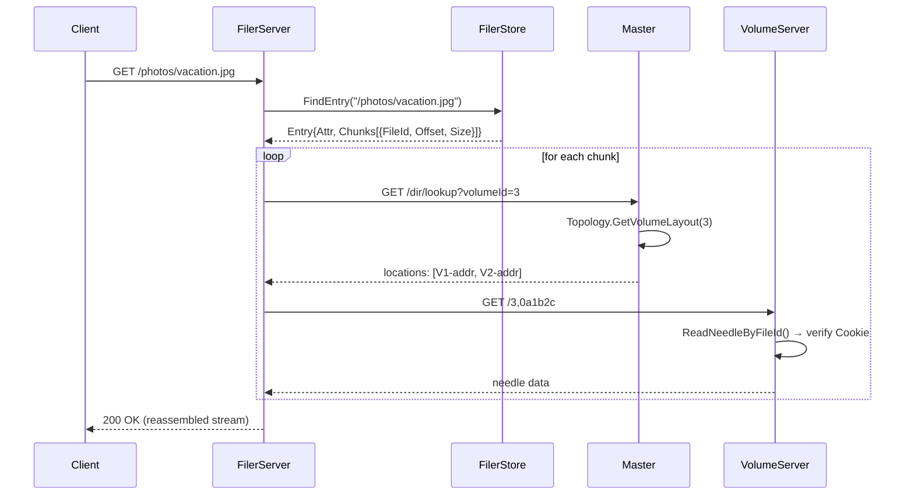

---

## Sequence — S3 PutObject

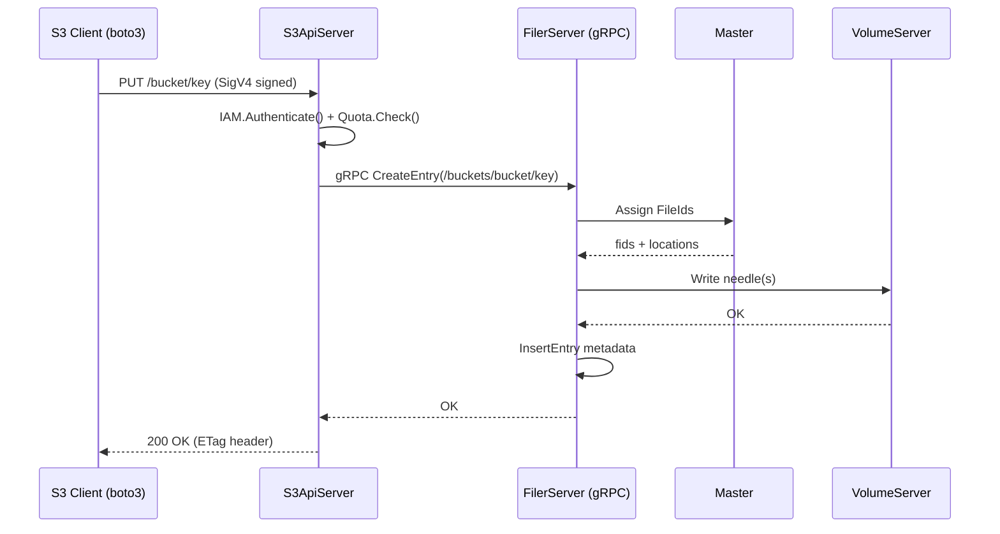

---

## Sequence — Raft Leader Election & Sequencer

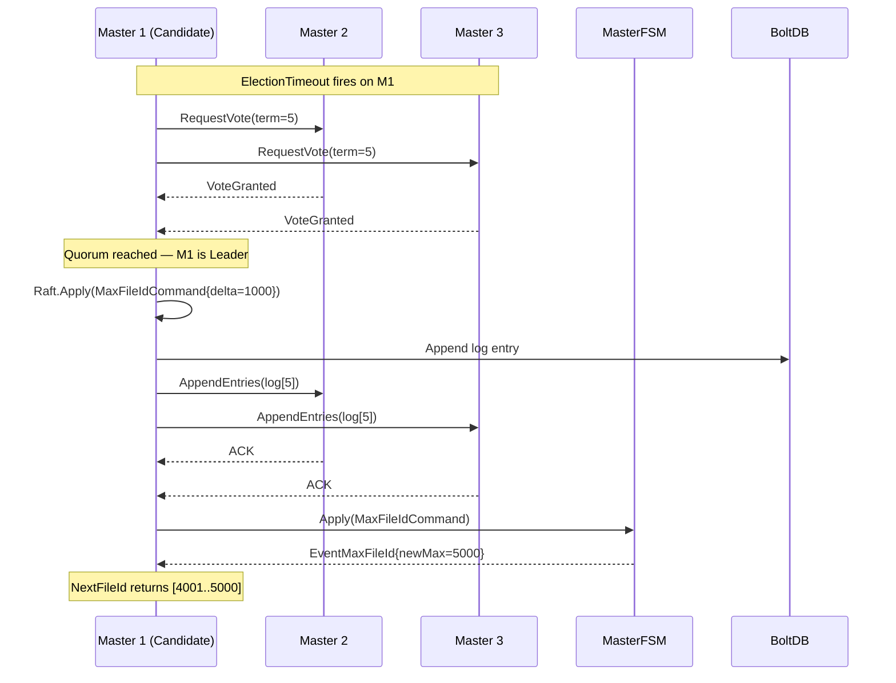

---

## Volume Lifecycle — State Diagram

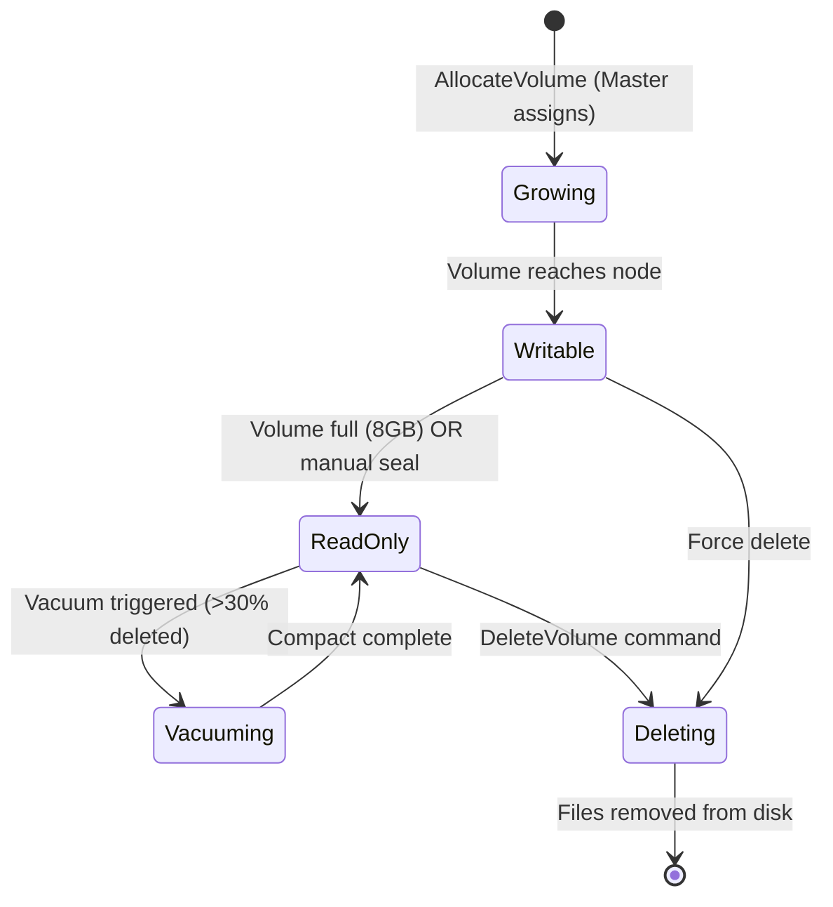

---

## Topology Tree

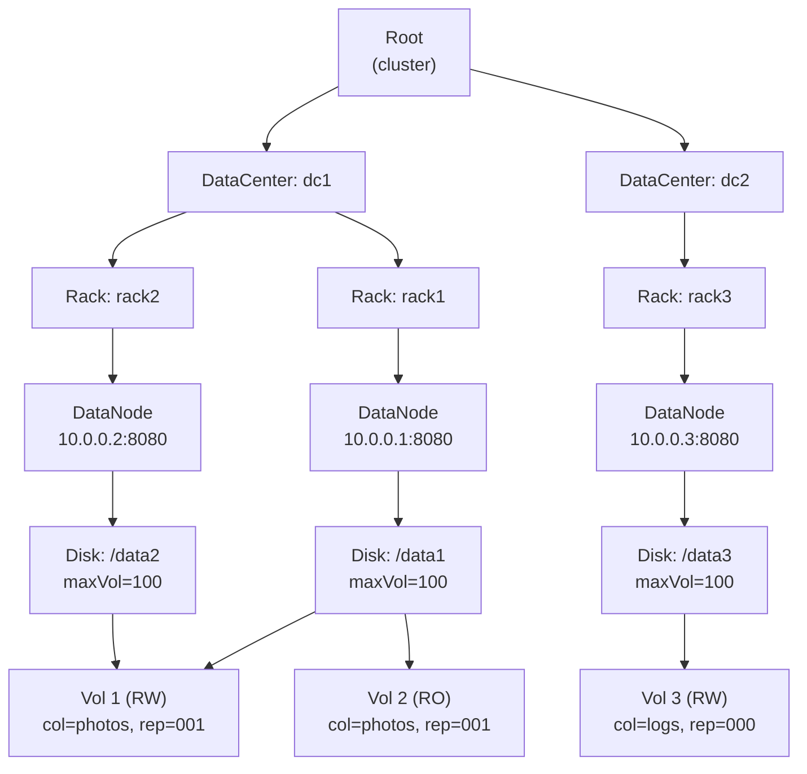

---

## Replication Placement — ReplicaPlacement Encoding

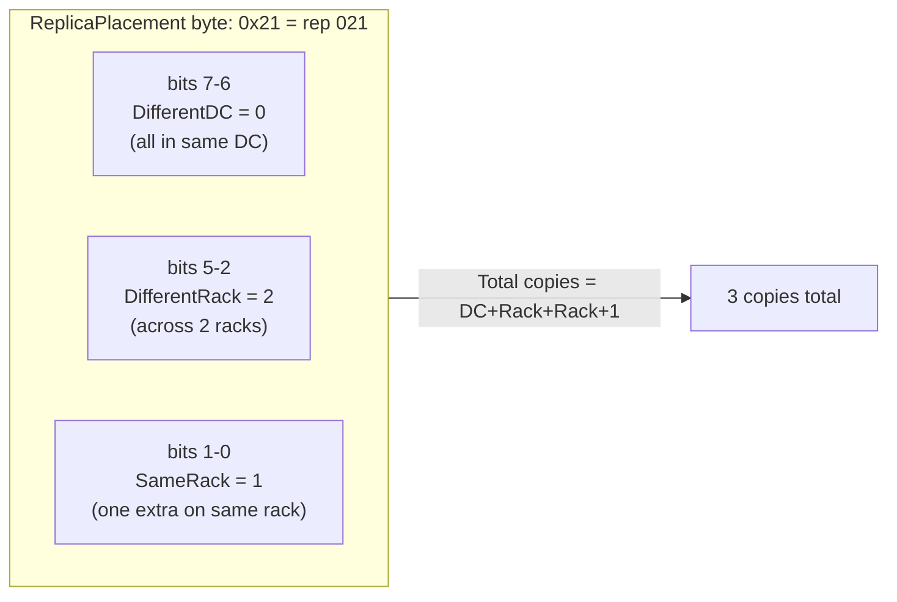

---

## Needle Storage Format — Volume File Layout

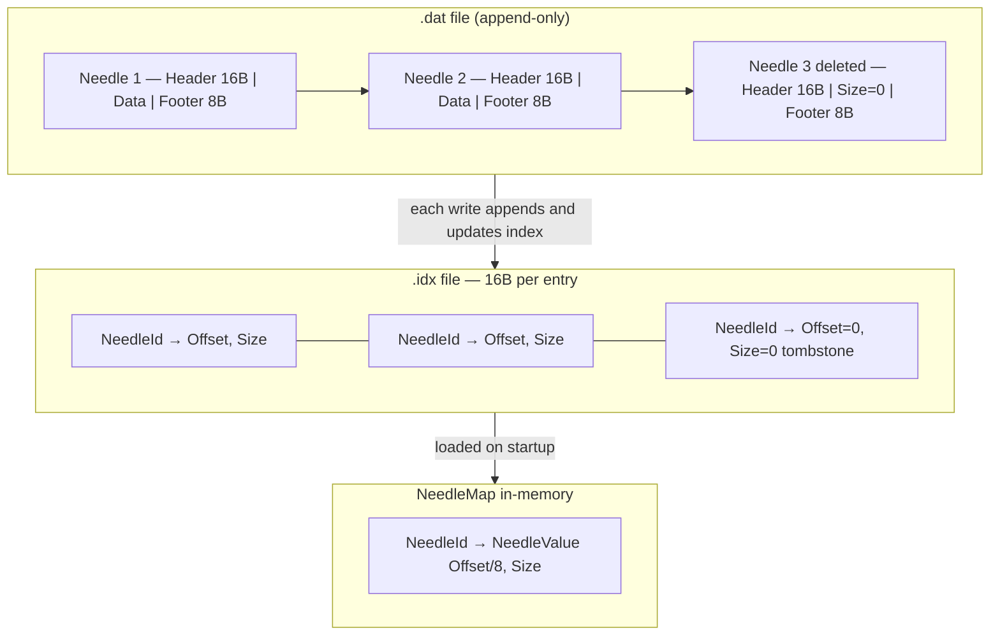

---

## FilerStore — Entry Data Model

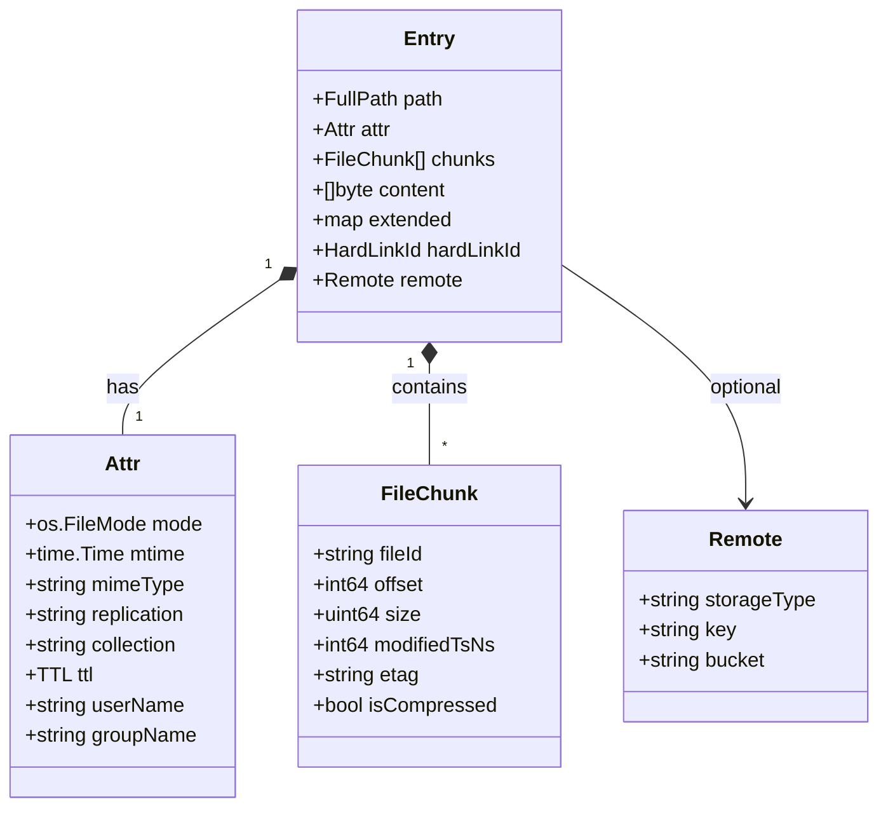

---

## Security Layer

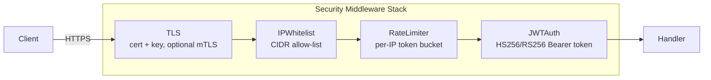
